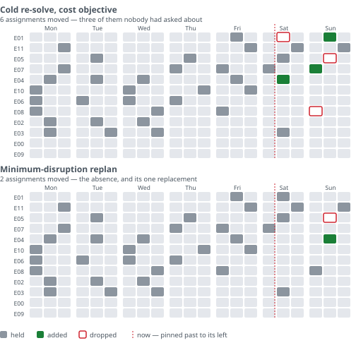

# roster-replan-optimizer

[](https://github.com/MoFirouzT/roster-replan-optimizer/actions/workflows/ci.yml)

**Minimum-disruption shift-roster replanning under labour constraints.**

Someone calls in sick at 09:00 on Saturday.
The conventional answer is to re-solve the week from scratch, which returns a roster that is optimal, legal, and heavily reshuffled;
people whose shifts were never in question are moved so the solver can shave a marginal cost.

This service answers it differently:
**reproduce the roster with minimum disruption to everyone else.**
Past shifts are pinned, and published shifts are penalised for changing which produces the low-disruption result.

Nothing comes back unexplained or unchecked.
Every roster is re-verified against every rule by a plain function with no solver involved, a short shift names the rule that blocked each person who could have filled it, and a policy written in plain English is accepted or rejected before it can produce a roster.

The reasoning is on the record too:
every design choice that could have gone the other way is a [numbered decision](docs/decisions.md), and the ones that turned on evidence are written up as [studies](docs/studies/README.md);
including the several that overturned what the specs first claimed.

> Generation is not a separate feature.
> It is the cold-start case of replanning; a replan from an empty roster.

---

## The difference, on one week



E05 calls in sick for Sunday evening. Both rosters below are legal, both staff every shift, and
both are optimal for the objective they were given.

The replan drops E05 and calls E04 in — the absence, and its replacement. The cold re-solve also
moves **E01, E07 and E08**, three people whose shifts were never in question, because nothing in a
cost objective prefers the roster they were already told about.

That is one case (`headline/1`, from the committed set) and not the set: across 72 cases the means
are 12.4 assignments moved against 2.4. Regenerate it with
`uv run python -m benchmarks.figure --write`.

---

## What it does

- **Replan:**
  repair a roster around absences, demand changes and late availability withdrawals, minimising weighted deviation from what people were already told.
  With no incumbent supplied, the same solve fills a planner's open shifts from scratch (a.k.a generation).
  [`specs/replan.md`](docs/specs/replan.md)
- **Verify every roster against the rules:**
  every returned solution is re-checked against every rule by a plain function with no solver involved.
  Nothing is returned unchecked, and a roster that still breaks a rule says which one.
  That matters most on the two fallback rungs no solver stands behind: a greedy repair, and the last known good roster.
  [`specs/validation.md`](docs/specs/validation.md)
- **Explain a short shift:**
  name the rule that blocked every person who could have filled it, in planner language:
  *e.g. 6 of the 12 staff do not hold a skill the shift requires.*
  This is a common case as with a soft coverage floor a shift comes back **priced** rather than refused.
  Where a single override would close the shift, say which, ranked by what it would cost, confirmed by re-solving rather than assumed from the blocker count.
  [`specs/service.md`](docs/specs/service.md#shortfall-recommendations)
- **Explain infeasibility:**
  in the rare case where no legal roster exists, return the *minimal* set of blocking rules with the day, shift and employee involved.
  [`specs/model.md`](docs/specs/model.md)
- **Answer a hypothetical:**
  *what if I hire one more flexi-jobber?*
  Re-solve under the change and report the difference.
  Unlawful hypotheticals are refused rather than answered.
  [`specs/service.md`](docs/specs/service.md#tool-surface)
- **Validate a policy before it can produce a roster:**
  structural checks, contradictions between a tenant's own rules, rules that cannot bind, and a feasibility probe.
  [`specs/config.md`](docs/specs/config.md)
- **Configure in natural language:**
  describe a tenant's policy in plain English;
  the parse emits a typed profile, which the validation bullet above then accepts or rejects.
  The model is confined by a **narrow schema rather than by instruction**:
  it has nowhere to write an objective weight or to switch on a rule the solver does not enforce.
  [`specs/config.md`](docs/specs/config.md)

> Belgian labour law is encoded as **data, not code**:
> rest gaps, weekly hour ceilings, flexi-job eligibility, same-day Dimona filing, student quotas, horeca minimum shift length.
> Rules carry stable IDs, for example `R-REST-GAP` for the minimum-rest rule, used identically in the specs, the model, the checker, the violation objects and the explainer.
> Full registry: [`docs/specs/rules.md`](docs/specs/rules.md).

---

## Reading guide

**Start at [`docs/README.md`](docs/README.md)** — four reading paths, from a five-minute skim to the
forty-five-minute one through the model. For the shape of the model on one page, go straight to
[`docs/formulation.md`](docs/formulation.md).

**If you only read one thing, make it a place the project was wrong.** The optimum was
[degenerate](docs/decisions.md#d-119) and nobody noticed until a CI runner disagreed with a laptop; the
[horizon rejection](docs/studies/horizon.md) in the spec was upheld on evidence that contradicted
both reasons it gave; and the [mutation harness](docs/decisions.md#d-139) reported `clean` three times
while a defect sat in the working tree.

---

## Results

**The disruption metric.** Swapping a cost objective for a disruption objective, against an otherwise
identical cold re-solve, is what produces the result below. Full definition of the score and the method
behind it: [`docs/specs/replan.md`](docs/specs/replan.md) and
[`docs/benchmarks.md`](docs/benchmarks.md).

See it on one case (this is one scenario, not the 84-case set below; full reproduction is in
[`docs/quickstart.md`](docs/quickstart.md)):

```bash
uv sync
uv run python -m roster_replan.demo scenarios/saturday_sick_call.json --weekday-of-day-zero 0
```

Measured on the committed set in `benchmarks/manifest.json` (seeded generator, 84 cases across
14 scenario classes, 8–25 employees, one-week horizon), 3 solver seeds each, single-threaded.
Full method, segmentation and caveats in [`docs/benchmarks.md`](docs/benchmarks.md).

Weeks that were fully staffable before the disruption — 72 of the 84 cases, at the 5 s budget. Every method is scored on
the same D2 yardstick whatever it optimised; `changes` is assignments differing from the published
roster, `short` is positions left unstaffed.

| Method | p50 search | p95 search | Disruption (D2) | Changes | Short |
| --- | --- | --- | --- | --- | --- |
| Cold re-solve, cost objective | 3.61 ms | 10.5 ms | 307.3 | 12.36 | 0.15 |
| Greedy nearest-eligible repair | — | — | 53.6 | 1.94 | 0.31 |
| Cold solve, disruption objective | 3.58 ms | 10.7 ms | 65.3 | 2.40 | 0.15 |
| **Warm-started replan (this)** | 3.31 ms | 8.6 ms | 65.3 | 2.40 | 0.15 |

**The objective is what does the work**, not the warm start. The solve is also warm-started from the
roster it is repairing, but purely for speed, and the two rows above measure the effects separately to
confirm that split. Against a cold cost re-solve on identical
instances with identical coverage, the disruption objective cuts the score from 307 to 65 and the
number of people moved from 12.4 to 2.4. The warm start is worth about 9% of a 3 ms search — real,
paired on 662 of 756 runs, and small enough that the honest framing is the one above.

**Greedy is not the weak baseline it looks like.** It ties the optimal replan exactly on 71 of the 84
cases. Its lower average disruption is bought by leaving more shifts unstaffed, which is the trade
the shortfall weight exists to refuse. The optimiser earns its place on the 13 cases where the repair
needs a chain — move an uninvolved person so somebody else comes free — and on never being the one to
leave a shift uncovered.

That tie rate is a property of where the set samples, not of greedy: on a slack week greedy ties every
seed, and on a stretched one it loses half of them. The set now samples the middle of the coverage
axis as well as its ends ([`D-105`](docs/decisions.md#d-105)).

The frontier is coverage, not cost: with a flat rate and a hard coverage ceiling, every fully staffed
roster costs the same paid hours, so the cost axis collapses. See
[`docs/benchmarks.md`](docs/benchmarks.md) for the per-class table and for what this set does *not*
show — nothing here ever came close to a time budget, and median damage is one assignment.

The performance work behind these numbers, including the five levers that did not pay off, is indexed
in [`docs/studies/README.md`](docs/studies/README.md).

---

## Correctness

The model and the checker are two independent implementations of the same specification.
They share no rule logic — no predicate, no threshold — enforced in CI, and the differential harness is how we know which one is wrong.
Solver objectives are held against exhaustively enumerated optima on committed micro-instances, so the correctness claim rests on ground truth rather than on the solver agreeing with itself.

The reproducibility claim carried a silent bug of its own: the optimum was degenerate, and which
roster came back was decided by the solver binary rather than the specification, without any test
noticing. That finding and its fix are indexed as a study: [`docs/studies/README.md`](docs/studies/README.md) ([`D-119`](docs/decisions.md#d-119), [`D-121`](docs/decisions.md#d-121)).

Test layers, invariants and the harness design: [`docs/specs/validation.md`](docs/specs/validation.md).

---

## How it fits together

The solver service is **stateless** and **async by construction**; the LLM never sits in the solve
path, and policy is a document rather than code. A fallback ladder — exact → time-boxed with a
reported gap → greedy repair → last known good — means the service never returns nothing.

The diagram, the reasoning behind each of those, and the repository map are in
[`docs/README.md`](docs/README.md#how-it-fits-together).

---

## Deliberately out of scope

Authentication, persistence, a user interface, and demand forecasting.
All data committed to this repository is synthetic.
The forecast → optimise interface is documented in [`docs/specs/model.md`](docs/specs/model.md), not implemented.

---

MIT licensed. See [`LICENSE`](LICENSE).
